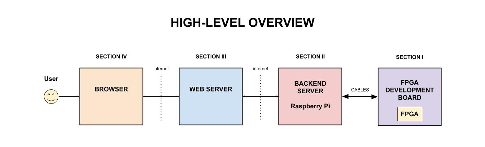
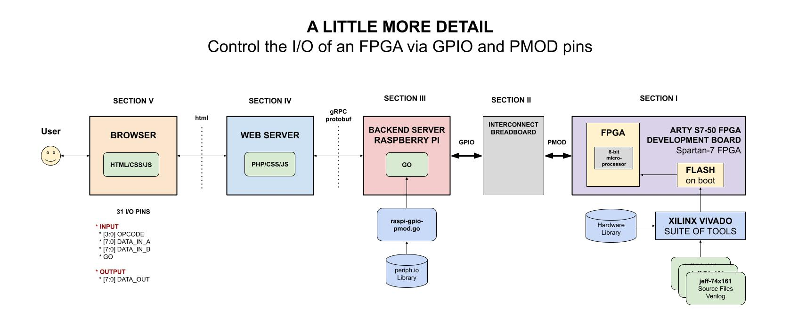
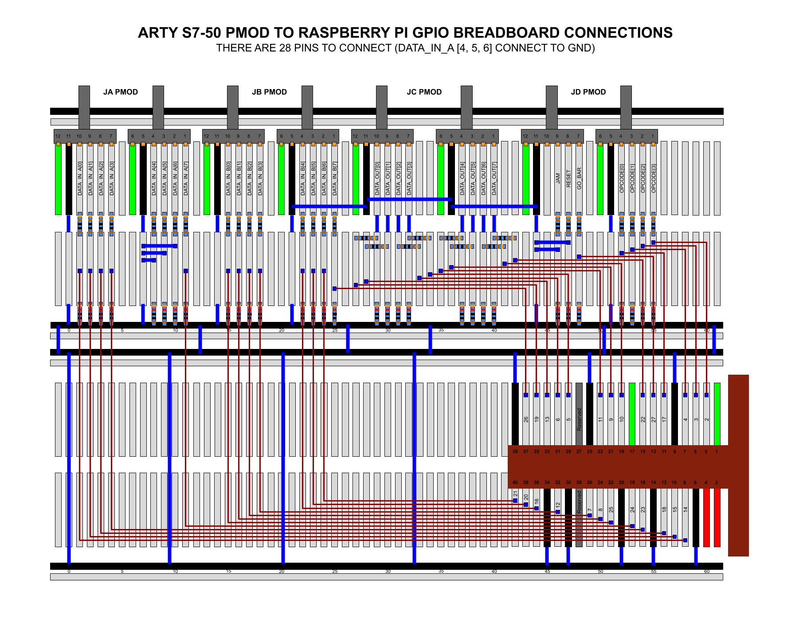

# CONTROL FPGA VIA RASPI AND WEBSERVER

[](https://github.com/JeffDeCola/control-fpga-via-raspi-and-webserver/tags)
[](https://codeclimate.com/github/JeffDeCola/control-fpga-via-raspi-and-webserver/issues)
[](https://hub.docker.com/r/jeffdecola/control-fpga-via-raspi-and-webserver/)
[](https://jeffdecola.mit-license.org)
[](https://jeffdecola.com)

```text
*** THE REPO IS UNDER CONSTRUCTION - CHECK BACK SOON ***
```

_Control a FPGA via a Raspberry Pi and a Webserver. As an example, I burned my
[programable-8-bit-microprocessor](https://github.com/JeffDeCola/my-systemverilog-examples/tree/master/systems/microprocessors/programable-8-bit-microprocessor)
to an FPGA development board and you can control it at
[jeffdecola.com/control-an-fpga](https://jeffdecola.com/control-an-fpga)._

Table of Contents

* [TRY IT](https://github.com/JeffDeCola/control-fpga-via-raspi-and-webserver#try-it)
* [OVERVIEW](https://github.com/JeffDeCola/control-fpga-via-raspi-and-webserver#overview)
* [A LITTLE MORE DETAIL](https://github.com/JeffDeCola/control-fpga-via-raspi-and-webserver#a-little-more-detail)
* [PREREQUISITES](https://github.com/JeffDeCola/control-fpga-via-raspi-and-webserver#prerequisites)
* [SOFTWARE STACK](https://github.com/JeffDeCola/control-fpga-via-raspi-and-webserver#software-stack)
* [SECTION I - THE FPGA](https://github.com/JeffDeCola/control-fpga-via-raspi-and-webserver#section-i---the-fpga)
* [SECTION II - THE RASPBERRY PI](https://github.com/JeffDeCola/control-fpga-via-raspi-and-webserver#section-ii---the-raspberry-pi)
  * [RUN](https://github.com/JeffDeCola/control-fpga-via-raspi-and-webserver#run)
  * [CREATE BINARY](https://github.com/JeffDeCola/control-fpga-via-raspi-and-webserver#create-binary)
  * [RASPBERRY PI TO FPGA DEV BOARD INTERFACE (GPIO to PMOD)](https://github.com/JeffDeCola/control-fpga-via-raspi-and-webserver#raspberry-pi-to-fpga-dev-board-interface-gpio-to-pmod)
  * [RASPBERRY PI TO WEBSERVER INTERFACE (REST JSON API)](https://github.com/JeffDeCola/control-fpga-via-raspi-and-webserver#raspberry-pi-to-webserver-interface-rest-json-api)
  * [STEP 1 - TEST](https://github.com/JeffDeCola/control-fpga-via-raspi-and-webserver#step-1---test)
  * [STEP 2 - BUILD (DOCKER IMAGE VIA DOCKERFILE)](https://github.com/JeffDeCola/control-fpga-via-raspi-and-webserver#step-2---build-docker-image-via-dockerfile)
  * [STEP 3 - PUSH (TO DOCKERHUB)](https://github.com/JeffDeCola/control-fpga-via-raspi-and-webserver#step-3---push-to-dockerhub)
  * [STEP 4 - DEPLOY (TO DOCKER)](https://github.com/JeffDeCola/control-fpga-via-raspi-and-webserver#step-4---deploy-to-docker)
  * [CONTINUOUS INTEGRATION & DEPLOYMENT](https://github.com/JeffDeCola/control-fpga-via-raspi-and-webserver#continuous-integration--deployment)
* [SECTION III - THE WEB SERVER](https://github.com/JeffDeCola/control-fpga-via-raspi-and-webserver#section-iii---the-web-server)
* [SECTION IV - THE BROWSER](https://github.com/JeffDeCola/control-fpga-via-raspi-and-webserver#section-iv---the-browser)

Documentation and Reference

* I burned my
  [programable-8-bit-microprocessor](https://github.com/JeffDeCola/my-systemverilog-examples/tree/master/systems/microprocessors/programable-8-bit-microprocessor)
  to a FPGA
* The
  [control-fpga-via-raspi-and-webserver](https://hub.docker.com/r/jeffdecola/control-fpga-via-raspi-and-webserver)
  docker image at dockerhub
* [raspi-gpio](https://github.com/JeffDeCola/my-go-examples/tree/master/single-board-computers/raspi-gpio)
  is an example of controlling the GPIO (Input/Output)
  on the Raspberry Pi using go
* This repos
  [github webpage](https://jeffdecola.github.io/control-fpga-via-raspi-and-webserver/)
  _built with
  [concourse](https://github.com/JeffDeCola/control-fpga-via-raspi-and-webserver/blob/master/ci-README.md)_

## TRY IT

I have a working demo at
[jeffdecola.com/control-an-fpga](https://jeffdecola.com/control-an-fpga).

## OVERVIEW

This project is separated into 4 main sections,

1. The FPGA
1. The BACKEND SERVER (Raspberry Pi) to control the I/O of the FPGA
1. The WEB SERVER (bluehost) providing to control the Raspberry Pi
1. The BROWSER to provide a GUI

This may help,



## A LITTLE MORE DETAIL

The following figure provides more details and will be explained
in the following four sections,



## PREREQUISITES

You will need the following go packages,

```bash
go get -u -v github.com/sirupsen/logrus
go get -u -v github.com/cweill/gotests/...
go get periph.io/x/cmd/...
```

## SOFTWARE STACK

* DEVELOPMENT
  * [go](https://github.com/JeffDeCola/my-cheat-sheets/tree/master/software/development/languages/go-cheat-sheet)
  * gotests
* OPERATIONS
  * [concourse/fly](https://github.com/JeffDeCola/my-cheat-sheets/tree/master/software/operations/continuous-integration-continuous-deployment/concourse-cheat-sheet)
    (optional)
  * [docker](https://github.com/JeffDeCola/my-cheat-sheets/tree/master/software/operations/orchestration/builds-deployment-containers/docker-cheat-sheet)
* SERVICES
  * [dockerhub](https://hub.docker.com/)
  * [github](https://github.com/)

Where,

* **GUI**
  _golang net/http package and ReactJS_
* **Routing & REST API framework**
  _golang gorilla/mux package_
* **Backend**
  _golang_
* **Database**
  _N/A_

## SECTION I - THE FPGA

My
[programable-8-bit-microprocessor](https://github.com/JeffDeCola/my-systemverilog-examples/tree/master/systems/microprocessors/programable-8-bit-microprocessor)
will be used as an example. Please refer to that repo on how to burn a
FPGA from verilog.

In that repo,

* I designed the 8-bit microprocessor in
  [Verilog](https://github.com/JeffDeCola/my-cheat-sheets/tree/master/hardware/development/languages/verilog-cheat-sheet)
  (An HDL language)
* Used the
  [Xilinx Vivado](https://github.com/JeffDeCola/my-cheat-sheets/tree/master/hardware/tools/synthesis/xilinx-vivado-cheat-sheet)
  IDE to synthesize and burn/flash on boot the FPGA
* Used a
  [Digilent ARTY-S7](https://github.com/JeffDeCola/my-cheat-sheets/tree/master/hardware/development/fpga-development-boards/digilent-arty-s7-cheat-sheet)
  FPGA development board

To operate this microprocessor, the Raspberry Pi will,

* Set both inputs [7:0] DATA_IN_A and [7:0] DATA_IN_B
* Select an [3:0] OPCODE instruction (such as ADD)
  * 0011: ADD
  * 0111: SUBTRACT
  * 1100: MULTIPLY
  * 1110: DIVIDE
* Enable the GO_BAR via GO signal
* Observe the resulting [7:0] DATA_OUT

The number of I/O the Raspberry Pi can control is 26 I/O pins.
But as shown in the following figure, the microprocessor has 31 pins.
The next section will go over which 5 pins we hardcoded or will be
controlled by the FPGA development board,


## SECTION II - THE RASPBERRY PI

The Raspberry Pi shall do two things,

* Control 26 pins of the I/O of the FPGA (GPIO to PMOD)
* Provide an interface to the webserver (REST JSON API)

### RUN

To
[run.sh](https://github.com/JeffDeCola/control-fpga-via-raspi-and-webserver/blob/master/control-fpga-via-raspi-and-webserver-code/run.sh),

```bash
cd control-fpga-via-raspi-and-webserver-code
go run main.go
```

As a placeholder, every 2 seconds it will print,

```txt
    INFO[0000] Let's Start this!
    Hello everyone, count is: 1
    Hello everyone, count is: 2
    Hello everyone, count is: 3
    etc...
```

### CREATE BINARY

To
[create-binary.sh](https://github.com/JeffDeCola/control-fpga-via-raspi-and-webserver/blob/master/control-fpga-via-raspi-and-webserver-code/bin/create-binary.sh),

```bash
cd control-fpga-via-raspi-and-webserver-code/bin
go build -o control-fpga-via-raspi-and-webserver ../main.go
./control-fpga-via-raspi-and-webserver
```

This binary will not be used during a docker build
since it creates it's own.

### RASPBERRY PI TO FPGA DEV BOARD INTERFACE (GPIO to PMOD)

The GPIO (Input/Output) of the Raspberry Pi is connected to the
Input/Output of the FPGA development board via Pmod connectors.
On a side note, it may be a good idea to place a 200 Ohm resister in-line.

All of the GPIOs have weak internal pull-ups and downs which may be enabled
or disabled by software. I control this in my go code.

There are a total of 26 I/O pins that you may use in the Raspberry Pi.
But I have a total of 31 I would like to use.  So I had to compromise
and hardcoded 5 of the Inputs (????).

The Raspberry Pi will connect to the processor as follows,

* **OUTPUT (SET)**
  * [3:0] OPCODE
  * GO_BAR
  * RESET (N/C)
  * JAM (N/C)
  * [7:0] DATA_IN_A (Bits 4,5,6 hardcoded to low)
  * [7:0] DATA_IN_B
* **INPUT (GET)**
  * [7:0] DATA_OUT

A go program is used to control and capture the I/O.

The pin list between the Raspberry Pi and the FPGA development
board is as follows,

|                     | PMOD Pins         | RasPi GPIO Pin        |
|--------------------:|:-----------------:|:---------------------:|
| **[7:0] DATA_IN_A** |  JA PMOD          |                       |
| [7]                 |  1                | 18 (GPIO24)           |
| **(GND)** [6]       |  2                | N/C                   |
| **(GND)** [5]       |  3                | N/C                   |
| **(GND)** [4]       |  4                | N/C                   |
| [3]                 |  7                | 16 (GPIO23)           |
| [2]                 |  8                | 12 (GPIO18)           |
| [1]                 |  9                | 10 (GPIO15)           | Disable serial using raspi-config
| [0]                 |  10               | 08 (GPIO14)           | Disable serial using raspi-config
|                     |                   |                       |
| **[7:0] DATA_IN_B** |  JB PMOD          |                       |
|                     |                   |                       |
| [7]                 |  1                | 37 (GPIO26)           |
| [6]                 |  2                | 40 (GPIO21)           |
| [5]                 |  3                | 38 (GPIO20)           |
| [4]                 |  4                | 36 (GPIO16)           |
| [3]                 |  7                | 32 (GPIO12)           |
| [2]                 |  8                | 26 (GPIO7)            |
| [1]                 |  9                | 24 (GPIO8)            |
| [0]                 |  10               | 22 (GPIO25)           |
|                     |                   |                       |
| **[7:0] DATA_OUT**  |  JC PMOD          |                       |
|                     |                   |                       |
| [7]                 |  1                | 15 (GPIO22)           |
| [6]                 |  2                | 19 (GPIO10)           |
| [5]                 |  3                | 21 (GPIO9)            |
| [4]                 |  4                | 23 (GPIO11)           |
| [3]                 |  7                | 29 (GPIO5)            |
| [2]                 |  8                | 31 (GPIO6)            |
| [1]                 |  9                | 33 (GPIO13)           |
| [0]                 |  10               | 35 (GPIO19)           |
|                     |                   |                       |
| **[3:0] OPCODE**    |  JD PMOD          |                       |
|                     |                   |                       |
| [3]                 |  1                | 03 (GPIO2)            |
| [2]                 |  2                | 05 (GPIO3)            |
| [1]                 |  3                | 07 (GPIO4)            |
| [0]                 |  4                | 11 (GPIO17)           |
| GO_BAR              |  7                | 13 (GPIO27)           |
| **(GND)** RESET     |  8                | N/C                   |
| **(GND)** JAM       |  9                | N/C                   |
| N/C                 |  10               | N/C                   |



### RASPBERRY PI TO WEBSERVER INTERFACE (REST JSON API)

tbd.

### STEP 1 - TEST

To create unit `_test` files,

```bash
cd control-fpga-via-raspi-and-webserver-code
gotests -w -all main.go
```

To run
[unit-tests.sh](https://github.com/JeffDeCola/control-fpga-via-raspi-and-webserver/tree/master/control-fpga-via-raspi-and-webserver-code/test/unit-tests.sh),

```bash
go test -cover ./... | tee test/test_coverage.txt
cat test/test_coverage.txt
```

### STEP 2 - BUILD (DOCKER IMAGE VIA DOCKERFILE)

To
[build.sh](https://github.com/JeffDeCola/control-fpga-via-raspi-and-webserver/blob/master/control-fpga-via-raspi-and-webserver-code/build/build.sh)
with a
[Dockerfile](https://github.com/JeffDeCola/control-fpga-via-raspi-and-webserver/blob/master/control-fpga-via-raspi-and-webserver-code/build/Dockerfile),

```bash
cd control-fpga-via-raspi-and-webserver-code
docker build -f build/Dockerfile -t jeffdecola/control-fpga-via-raspi-and-webserver .
```

You can check and test this docker image,

```bash
docker images jeffdecola/control-fpga-via-raspi-and-webserver:latest
docker run --name control-fpga-via-raspi-and-webserver -dit jeffdecola/control-fpga-via-raspi-and-webserver
docker exec -i -t control-fpga-via-raspi-and-webserver /bin/bash
docker logs control-fpga-via-raspi-and-webserver
docker rm -f control-fpga-via-raspi-and-webserver
```

In **stage 1**, rather than copy a binary into a docker image (because
that can cause issues), the Dockerfile will build the binary in the
docker image,

```bash
FROM golang:alpine AS builder
RUN go get -d -v
RUN go build -o /go/bin/control-fpga-via-raspi-and-webserver main.go
```

In **stage 2**, the Dockerfile will copy the binary created in
stage 1 and place into a smaller docker base image based
on `alpine`, which is around 13MB.

### STEP 3 - PUSH (TO DOCKERHUB)

You must be logged in to DockerHub,

```bash
docker login
```

To
[push.sh](https://github.com/JeffDeCola/control-fpga-via-raspi-and-webserver/blob/master/control-fpga-via-raspi-and-webserver-code/push/push.sh),

```bash
docker push jeffdecola/control-fpga-via-raspi-and-webserver
```

Check the
[control-fpga-via-raspi-and-webserver docker image](https://hub.docker.com/r/jeffdecola/control-fpga-via-raspi-and-webserver)
at DockerHub.

### STEP 4 - DEPLOY (TO DOCKER)

To
[deploy.sh](https://github.com/JeffDeCola/control-fpga-via-raspi-and-webserver/blob/master/control-fpga-via-raspi-and-webserver-code/deploy/deploy.sh),

```bash
cd control-fpga-via-raspi-and-webserver-code
docker run --name control-fpga-via-raspi-and-webserver -dit jeffdecola/control-fpga-via-raspi-and-webserver
docker exec -i -t control-fpga-via-raspi-and-webserver /bin/bash
docker logs control-fpga-via-raspi-and-webserver
docker rm -f control-fpga-via-raspi-and-webserver
```

### CONTINUOUS INTEGRATION & DEPLOYMENT

Refer to
[ci-README.md](https://github.com/JeffDeCola/control-fpga-via-raspi-and-webserver/blob/master/ci-README.md)
on how I automated the above steps.

## SECTION III - THE WEB SERVER

tbd

## SECTION IV - THE BROWSER

tbd
