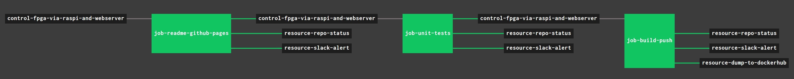

# control-fpga-via-raspi-and-webserver

[](https://codeclimate.com/github/JeffDeCola/control-fpga-via-raspi-and-webserver/issues)
[](http://jeffdecola.mit-license.org)

_Control a FPGA via a Raspberry Pi and a Webserver. As an example, I burned my
[programable-8-bit-microprocessor](https://github.com/JeffDeCola/my-systemverilog-examples/tree/master/systems/microprocessors/programable-8-bit-microprocessor)
to an FPGA development board and you can control it at
[jeffdecola.com/fpga](http://jeffdecola.com/fpga)._

Table of Contents,

* [OVERVIEW](https://github.com/JeffDeCola/control-fpga-via-raspi-and-webserver#overview)
* [A LITTLE MORE DETAIL](https://github.com/JeffDeCola/control-fpga-via-raspi-and-webserver#a-little-more-detail)
* [SECTION I - THE FPGA](https://github.com/JeffDeCola/control-fpga-via-raspi-and-webserver#section-i---the-fpga)
* [SECTION II - THE RASPBERRY PI](https://github.com/JeffDeCola/control-fpga-via-raspi-and-webserver#section-ii---the-raspberry-pi)
  * [GPIO TO PMOD INTERFACE](https://github.com/JeffDeCola/control-fpga-via-raspi-and-webserver#gpio-to-pmod-interface)
  * [RASPBERRY PI TO WEBSERVER INTERFACE](https://github.com/JeffDeCola/control-fpga-via-raspi-and-webserver#raspberry-pi-to-webserver-interface)
* [SECTION III - THE WEBSERVER](https://github.com/JeffDeCola/control-fpga-via-raspi-and-webserver#section-iii---the-webserver)

Documentation and reference,

* I burned my
  [programable-8-bit-microprocessor](https://github.com/JeffDeCola/my-systemverilog-examples/tree/master/systems/microprocessors/programable-8-bit-microprocessor)
  to a FPGA
* [raspi-gpio](https://github.com/JeffDeCola/my-go-examples/tree/master/single-board-computers/raspi-gpio)
is an example of controlling the GPIO (Input/Output) on the Raspberry Pi using go

[GitHub Webpage](https://jeffdecola.github.io/control-fpga-via-raspi-and-webserver/)

## OVERVIEW

This project is separated into 3 sections,

1. The FPGA
2. The Raspberry Pi (go code) to control the I/O of the FPGA
3. The Webserver to control the Raspberry Pi

This may help,


## A LITTLE MORE DETAIL

The following figure will be explained in the following three sections,


## SECTION I - THE FPGA

My
[programable-8-bit-microprocessor](https://github.com/JeffDeCola/my-systemverilog-examples/tree/master/systems/microprocessors/programable-8-bit-microprocessor)
will be used as an example. In that repo,

* I designed the 8-bit microprocessor in
  [Verilog](https://github.com/JeffDeCola/my-cheat-sheets/tree/master/hardware/development/languages/systemverilog-cheat-sheet)
  (An HDL language)
* Used the
  [Xilinx Vivado](https://github.com/JeffDeCola/my-cheat-sheets/tree/master/hardware/tools/synthesis/xilinx-vivado-cheat-sheet)
  IDE to synthesize and burn/flash on boot the FPGA
* Used a
  [Digilent ARTY-S7](https://github.com/JeffDeCola/my-cheat-sheets/tree/master/hardware/tools/synthesis/xilinx-vivado-cheat-sheet)
  FPGA development board 

To operate this microprocessor, the Raspberry Pi will,

* Set both inputs [7:0] DATA_IN_A and [7:0] DATA_IN_B
* Select an [3:0] OPCODE instruction (such as ADD)
  * 0011: ADD
  * 0111: SUBTRACT
  * 1100: MULTIPLY
  * 1110: DIVIDE
* Enable the GO_BAR
* Oserve the resulting [7:0] DATA_OUT

The next section will show how to control the I/O via a Raspberry Pi.


## SECTION II - THE RASPBERRY PI

The Raspberry Pi shall control the I/O of the FPGA and provide an interface to
the webserver. The code has been written is go using the
[google/periph](https://github.com/google/periph)
go library.

To run the go code,

```
go get -u periph.io/x/periph/cmd/...
sh run.go
```

### GPIO TO PMOD INTERFACE

The GPIO (Input/Output) of the Raspberry Pi is connected to the
Input/Ouput of the FPGA development board via Pmod connectors.
On a side note, it may be a good idea to place a 200 Ohm resister in-line.

All of the GPIOs have weak internal pull-ups and downs which may be enabled
or disabled by software. Refer to init file in my go code.

There are a total of 26 I/O pins that you may use in the Raspberry Pi.
But I have a total of 31 I would like to use.  So I had to compromise
and hardcode 5 of the bits.

The Raspberry Pi will connect to the processor as follows,

* **OUTPUT (SET)**
  * [3:0] OPCODE
  * GO_BAR
  * RESET (N/C)
  * JAM (N/C)
  * [7:0] DATA_IN_A (Bits 4,5,6 hardcoded to low)
  * [7:0] DATA_IN_B
* **INPUT (GET)**
  * [7:0] DATA_OUT

A go program is used to control and capture the I/O.

The pin list between the Raspberry Pi and the FPGA development
board is as follows,

|                 | PMOD Pins         | RasPi GPIO Pin        |
|----------------:|:-----------------:|:---------------------:|
| [7:0] DATA_IN_A |  JA PMOD          |                       |
| [7]             |  1                | 24 (GPIO8)            |
| [6] SET TO LOW  |  2                | --- N/C               |
| [5] SET TO LOW  |  3                | --- N/C               |
| [4] SET TO LOW  |  4                | --- N/C               |
| [3]             |  7                | 35 (GPIO19)           |
| [2]             |  8                | 40 (GPIO21)           |
| [1]             |  9                | 38 (GPIO20)           |
| [0]             |  10               | 12 (GPIO18)           |
|                 |                   |                       |
| [7:0] DATA_IN_B |  JB PMOD          |                       |
| [7]             |  1                | 26 (GPIO7)            |
| [6]             |  2                | 19 (GPIO10)           |
| [5]             |  3                | 21 (GPIO9)            |
| [4]             |  4                | 23 (GPIO11)           |
| [3]             |  7                | 37 (GPIO26)           |
| [2]             |  8                | 33 (GPIO13)           |
| [1]             |  9                | 05 (GPIO3)            |
| [0]             |  10               | 03 (GPIO2)            |
|                 |                   |                       |
| [7:0] DATA_OUT  |  JC PMOD          |                       |
| [7]             |  1                | 36 (GPIO16)           |
| [6]             |  2                | 08 (GPIO14)           |
| [5]             |  3                | 10 (GPIO15)           |
| [4]             |  4                | 11 (GPIO17)           |
| [3]             |  7                | 07 (GPIO4)            |
| [2]             |  8                | 32 (GPIO12)           |
| [1]             |  9                | 29 (GPIO5)            |
| [0]             |  10               | 31 (GPIO6)            |
|                 |                   |                       |
| [3:0] OPCODE    |  JD PMOD          |                       |
| [3]             |  1                | 13 (GPIO27)           |
| [2]             |  2                | 15 (GPIO22)           |
| [1]             |  3                | 16 (GPIO23)           |
| [0]             |  4                | 18 (GPIO24)           |
| GO              |  7                | 22 (GPIO25)           |
| RESET --- N/C   |  8                | --- N/C               |
| JAM --- N/C     |  9                | --- N/C               |
| N/C             |  10               | --- N/C               |

### RASPBERRY PI TO WEBSERVER INTERFACE

tbd

## SECTION III - THE WEBSERVER

tbd

## MY GITHUB WEBPAGE IS UPDATED USING CONCOURSE (OPTIONAL)

For fun, I use concourse to automatically update
[my GitHub Webpage](https://jeffdecola.github.io/control-fpga-via-raspi-and-webserver/) and alert me of
the changes via repo status and slack.

The update is accomplished this by copying and editing/updating
this `README.md` file to `/docs/_includes/README.md`.

A pipeline file [pipeline.yml](https://github.com/JeffDeCola/control-fpga-via-raspi-and-webserver/tree/master/ci/scripts/readme-github-pages.sh)
shows the entire ci flow. Visually, it looks like,



The `jobs` and `tasks` are,

* `job-readme-github-pages` runs task
  [readme-github-pages.sh](https://github.com/JeffDeCola/control-fpga-via-raspi-and-webserver/tree/master/ci/scripts/readme-github-pages.sh).

The concourse `resources types` are,

* `control-fpga-via-raspi-and-webserver` uses a resource type
  [docker-image](https://hub.docker.com/r/concourse/git-resource/)
  to PULL a repo from github.
* `resource-slack-alert` uses a resource type
  [docker image](https://hub.docker.com/r/cfcommunity/slack-notification-resource)
  that will notify slack on your progress.
* `resource-repo-status` uses a resource type
  [docker image](https://hub.docker.com/r/dpb587/github-status-resource)
  that will update your git status for that particular commit.

For more information on using concourse for continuous integration,
refer to my cheat sheet on [concourse](https://github.com/JeffDeCola/control-fpga-via-raspi-and-webserver/tree/master/software/operations-tools/continuous-integration-continuous-deployment/concourse-cheat-sheet).
