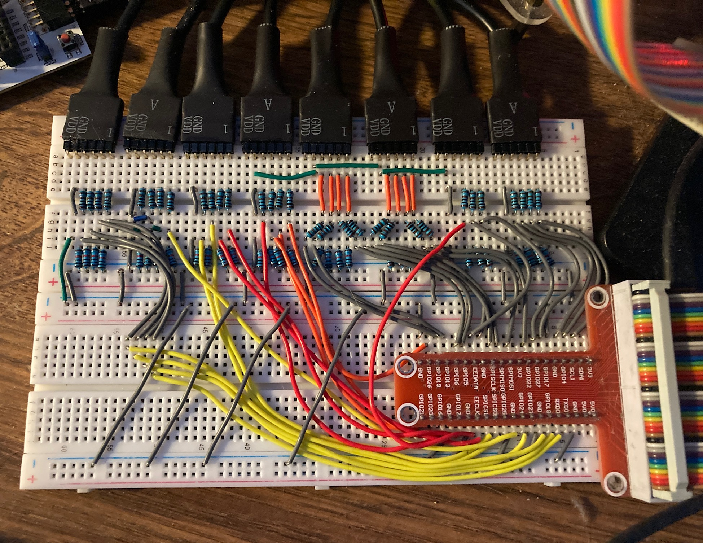

# CONTROL FPGA VIA RASPI AND WEBSERVER

[](https://github.com/JeffDeCola/control-fpga-via-raspi-and-webserver/tags)
[](https://codeclimate.com/github/JeffDeCola/control-fpga-via-raspi-and-webserver/issues)
[](https://hub.docker.com/r/jeffdecola/control-fpga-via-raspi-and-webserver/)
[](https://jeffdecola.mit-license.org)
[](https://jeffdecola.com)

```text
*** THE REPO IS UNDER CONSTRUCTION - SHOULD BE DONE JULY 1st, 2023 ***
```

_Control an FPGA via a Raspberry Pi and a web server._

Table of Contents

* [TRY IT](https://github.com/JeffDeCola/control-fpga-via-raspi-and-webserver#try-it)
* [OVERVIEW](https://github.com/JeffDeCola/control-fpga-via-raspi-and-webserver#overview)
* [SOFTWARE/HARDWARE STACK](https://github.com/JeffDeCola/control-fpga-via-raspi-and-webserver#softwarehardware-stack)
* [SECTION I - THE FPGA](https://github.com/JeffDeCola/control-fpga-via-raspi-and-webserver#section-i---the-fpga)
  * [FPGA (MY 8-BIT MICROPROCESSOR)](https://github.com/JeffDeCola/control-fpga-via-raspi-and-webserver#fpga-my-8-bit-microprocessor)
  * [SERVER SIDE (CONNECTION TO RASPBERRY PI)](https://github.com/JeffDeCola/control-fpga-via-raspi-and-webserver#server-side-connection-to-raspberry-pi)
* [SECTION II - THE BREADBOARD](https://github.com/JeffDeCola/control-fpga-via-raspi-and-webserver#section-ii---the-breadboard)
* [SECTION III - THE RASPBERRY PI](https://github.com/JeffDeCola/control-fpga-via-raspi-and-webserver#section-iii---the-raspberry-pi)
  * [CLIENT SIDE (CONNECTION TO FPGA)](https://github.com/JeffDeCola/control-fpga-via-raspi-and-webserver#client-side-connection-to-fpga)
  * [SERVER SIDE (CONNECTION TO WEB SERVER)](https://github.com/JeffDeCola/control-fpga-via-raspi-and-webserver#server-side-connection-to-web-server)
  * [DOCKER (GO INTEGRATION AND DEPLOYMENT)](https://github.com/JeffDeCola/control-fpga-via-raspi-and-webserver#docker-go-integration-and-deployment)
* [SECTION IV - THE WEB SERVER](https://github.com/JeffDeCola/control-fpga-via-raspi-and-webserver#section-iv---the-web-server)
  * [CLIENT SIDE (CONNECTION TO RASPBERRY PI)](https://github.com/JeffDeCola/control-fpga-via-raspi-and-webserver#client-side-connection-to-raspberry-pi)
  * [SERVER SIDE (CONNECTION TO BROWSER)](https://github.com/JeffDeCola/control-fpga-via-raspi-and-webserver#server-side-connection-to-browser)
* [SECTION V - THE BROWSER](https://github.com/JeffDeCola/control-fpga-via-raspi-and-webserver#section-v---the-browser)
  * [CLIENT SIDE (CONNECTION TO WEB SERVER)](https://github.com/JeffDeCola/control-fpga-via-raspi-and-webserver#client-side-connection-to-web-server)
  * [WEBSITE](https://github.com/JeffDeCola/control-fpga-via-raspi-and-webserver#website)

Documentation and Reference

* Try it
  [here](https://jeffdecola.com/control-an-fpga)
* I burned my
  [programable-8-bit-microprocessor](https://github.com/JeffDeCola/my-systemverilog-examples/tree/master/systems/microprocessors/programable_8_bit_microprocessor)
  to an FPGA
* The
  [control-fpga-via-raspi-and-webserver](https://hub.docker.com/r/jeffdecola/control-fpga-via-raspi-and-webserver)
  docker image at dockerhub
* [raspi-gpio](https://github.com/JeffDeCola/my-go-examples/tree/master/single-board-computers/raspi-gpio)
  is an example of controlling the GPIO (Input/Output)
  on the Raspberry Pi using go
* This repos
  [github webpage](https://jeffdecola.github.io/control-fpga-via-raspi-and-webserver/)
  _built with
  [concourse](https://github.com/JeffDeCola/control-fpga-via-raspi-and-webserver/blob/master/ci-README.md)_

## OVERVIEW

I burned my
[programable-8-bit-microprocessor](https://github.com/JeffDeCola/my-systemverilog-examples/tree/master/systems/microprocessors/programable-8-bit-microprocessor)
to an FPGA development board and you can control it at
[jeffdecola.com/control-an-fpga](https://jeffdecola.com/control-an-fpga)._

This project is separated into 5 main sections,

* **I** The FPGA (Digilent ARTY S7-50)
* **II**  The BREADBOARD
* **III** The BACKEND SERVER (Raspberry Pi 4B)
* **IV** The WEB SERVER (Bluehost)
* **V** The BROWSER

This may help,


## SOFTWARE/HARDWARE STACK

* SECTION I - The FPGA
  * [Verilog](https://github.com/JeffDeCola/my-cheat-sheets/tree/master/hardware/development/languages/verilog-cheat-sheet)
  * [Xilinx Vivado](https://github.com/JeffDeCola/my-cheat-sheets/tree/master/hardware/tools/synthesis/xilinx-vivado-cheat-sheet)
  * [Digilent ARTY-S7](https://github.com/JeffDeCola/my-cheat-sheets/tree/master/hardware/development/fpga-development-boards/digilent-arty-s7-cheat-sheet)
* SECTION II - The Breadboard
  * Connectors, resistors and wires
* SECTION III - The Backend Server
  * [Raspberry pi 4B](https://github.com/JeffDeCola/my-cheat-sheets/tree/master/other/stem/technology/single-board-computers/raspberry-pi/specifications-cheat-sheet)
  * [go](https://github.com/JeffDeCola/my-cheat-sheets/tree/master/software/development/languages/go-cheat-sheet)
  * [docker](https://github.com/JeffDeCola/my-cheat-sheets/tree/master/software/operations/orchestration/builds-deployment-containers/docker-cheat-sheet)
  * [dockerhub](https://hub.docker.com/)
  * [concourse](https://github.com/JeffDeCola/my-cheat-sheets/tree/master/software/operations/continuous-integration-continuous-deployment/concourse-cheat-sheet)
* SECTION IV - The Web Server
  * php
  * [bluehost](https://www.bluehost.com/)
* SECTION V - The Browser
  * js
  * html
  * css

## SECTION I - THE FPGA

Summary,

* I designed my
  [8-bit microprocessor](https://github.com/JeffDeCola/my-systemverilog-examples/tree/master/systems/microprocessors/programable_8_bit_microprocessor)
  in
  [Verilog](https://github.com/JeffDeCola/my-cheat-sheets/tree/master/hardware/development/languages/verilog-cheat-sheet)
  (An HDL language)
* I used the
  [Xilinx Vivado](https://github.com/JeffDeCola/my-cheat-sheets/tree/master/hardware/tools/synthesis/xilinx-vivado-cheat-sheet)
  IDE to synthesize and burn/flash the FPGA
* I used the
  [Digilent ARTY-S7](https://github.com/JeffDeCola/my-cheat-sheets/tree/master/hardware/development/fpga-development-boards/digilent-arty-s7-cheat-sheet)
  FPGA development board

### FPGA (MY 8-BIT MICROPROCESSOR)

I designed a
[programable-8-bit-microprocessor](https://github.com/JeffDeCola/my-systemverilog-examples/tree/master/systems/microprocessors/programable-8-bit-microprocessor)
in verilog and burned to an FPGA.  Refer to that repo on how I accomplished this.

#### VERILOG

This is the high level architecture of the 8-bit microprocessor
I designed in verilog,


#### INPUT/OUTPUT

* **INPUT**
  * SYSTEM_CLK
  * [3:0] OPCODE
  * GO_BAR
  * RESET
  * JAM
  * [7:0] DATA_IN_A
  * [7:0] DATA_IN_B
* **OUTPUT**
  * [7:0] DATA_OUT

#### ARTY S7-50 FPGA DEVELOPMENT BOARD

I burned the microprocessor to an FPGA on an
Arty S7-50 FPGA development board.


### SERVER SIDE (CONNECTION TO RASPBERRY PI)

The FPGA is connected to the Raspberry Pi via the PMOD pins.

## SECTION II - THE BREADBOARD

To connect the Raspberry Pi to the FPGA dev board, I used a breadboard.
I connected the GPIO pins on the Raspberry Pi 4B
to the PMOD pins on the FPGA development board.

There are a total of 31 pins used by the microprocessor,
but there are only 28 GPIO pins. Hence, I tied 3 of the
DATA_IN_A pins to gnd.

The pin list between the Raspberry Pi and the FPGA development
board is as follows,

|                     | PMOD Pins         | RasPi GPIO Pin        |
|--------------------:|:-----------------:|:---------------------:|
| **[7:0] DATA_IN_A** |  JA PMOD          |                       |
| [7]                 |  1                | 18 (GPIO24)           |
| **(GND)** [6]       |  2                | N/C                   |
| **(GND)** [5]       |  3                | N/C                   |
| **(GND)** [4]       |  4                | N/C                   |
| [3]                 |  7                | 16 (GPIO23)           |
| [2]                 |  8                | 12 (GPIO18)           |
| [1]                 |  9                | 10 (GPIO15)*          |
| [0]                 |  10               | 08 (GPIO14)*          |
|                     |                   |                       |
| **[7:0] DATA_IN_B** |  JB PMOD          |                       |
|                     |                   |                       |
| [7]                 |  1                | 37 (GPIO26)           |
| [6]                 |  2                | 40 (GPIO21)           |
| [5]                 |  3                | 38 (GPIO20)           |
| [4]                 |  4                | 36 (GPIO16)           |
| [3]                 |  7                | 32 (GPIO12)           |
| [2]                 |  8                | 26 (GPIO7)            |
| [1]                 |  9                | 24 (GPIO8)            |
| [0]                 |  10               | 22 (GPIO25)           |
|                     |                   |                       |
| **[7:0] DATA_OUT**  |  JC PMOD          |                       |
|                     |                   |                       |
| [7]                 |  1                | 15 (GPIO22)           |
| [6]                 |  2                | 19 (GPIO10)           |
| [5]                 |  3                | 21 (GPIO9)            |
| [4]                 |  4                | 23 (GPIO11)           |
| [3]                 |  7                | 29 (GPIO5)            |
| [2]                 |  8                | 31 (GPIO6)            |
| [1]                 |  9                | 33 (GPIO13)           |
| [0]                 |  10               | 35 (GPIO19)           |
|                     |                   |                       |
| **[3:0] OPCODE**    |  JD PMOD          |                       |
|                     |                   |                       |
| [3]                 |  1                | 03 (GPIO2)**          |
| [2]                 |  2                | 05 (GPIO3)**          |
| [1]                 |  3                | 07 (GPIO4)            |
| [0]                 |  4                | 11 (GPIO17)           |
| GO                  |  7                | 13 (GPIO27)           |
| RESET               |  8                | 27 (GPIO0)            |
| JAM                 |  9                | 28 (GPIO1)            |
| N/C                 |  10               | N/C                   |

**NOTE1**: To use pin 8 (GPIO14) and pin 10 (GPIO15)
you must disable the serial port using `raspi-config`.
Select `Interfacing Options` and then
`Serial` and select `No`.

**NOTE2** Pin 3 (GPIO2) and pin 5 (GPIO3) have
fixed pull-up resistors to 3.3V.


The result,




## SECTION III - THE RASPBERRY PI

The Raspberry Pi has two main functions,

* AS A CLIENT - Controls 28 pins of the I/O of the FPGA (GPIO to PMOD) via GO
* AS A SERVER - Provide an interface to the webserver (gRPC)

### CLIENT SIDE (CONNECTION TO FPGA)

The Raspberry Pi will control the I/O of the FPGA via the
GPIO pins. The Raspberry Pi will be the client and the FPGA
will be the server.

#### CONTROL FPGA I/O VIA GO

The Raspberry Pi will control the FPGA via GO using the
[periph.io](https://periph.io/)
go package.

Init Raspberry Pi,

```go
  // INIT HOST MACHINE (i.e. Raspberry Pi)
  _, err := host.Init()
  if err != nil {
    log.Fatal(err)
  }
```

For inputs,

```go
  // DATA_IN_A -----------------------------------
  DATA_IN_A7_PIN := gpioreg.ByName("24")
  if DATA_IN_A7_PIN == nil {
    log.Fatal("Failed to find DATA_IN_A7_PIN")
  }
```

For outputs also set the pulldown resistor,

```go
  // DATA_OUT -----------------------------------
  DATA_OUT_7_PIN := gpioreg.ByName("22")
  if DATA_OUT_7_PIN == nil {
    log.Fatal("Failed to find DATA_OUT_7_PIN")
  }

  // SET PULLDOWN RESISTER AND LOOK FOR BOTH EDGES (High->Low or Low->High)
  err = DATA_OUT_7_PIN.In(gpio.PullDown, gpio.BothEdges)
  if err != nil {
    log.Fatal(err)
  }
```

### SERVER SIDE (CONNECTION TO WEB SERVER)

The Raspberry Pi will also be a server using gRPC.
It will accept requests from a web server client and
return the results.

#### GO AND gRPC

tbd

### DOCKER (GO INTEGRATION AND DEPLOYMENT)

A go program will interface with both the FPGA and web server.
It will placed in a
[docker image](https://hub.docker.com/r/jeffdecola/control-fpga-via-raspi-and-webserver)
and deployed to a Raspberry Pi 4B.

#### RUN

To
[run.sh](https://github.com/JeffDeCola/control-fpga-via-raspi-and-webserver/blob/master/section-2-backend-server/run.sh),

```bash
cd section-2-backend-server
go run main.go
```

Currently, it will ask you if you want to add, subtract, multiply or divide.
It will look like,

```txt
1: add, 2: subtract, 3: multiply, 4: divide, x: exit: 1
    ADD
    DATA_IN_A: 10000011
    DATA_IN_B: 00001100
    DATA_OUT:  10001111 
```

#### CREATE BINARY

To
[create-binary.sh](https://github.com/JeffDeCola/control-fpga-via-raspi-and-webserver/blob/master/section-2-backend-server/bin/create-binary.sh),

```bash
cd section-2-backend-server/bin
go build -o control-fpga-via-raspi-and-webserver ../main.go
./control-fpga-via-raspi-and-webserver
```

This binary will not be used during a docker build
since it creates it's own.

#### STEP 1 - TEST

To create unit `_test` files,

```bash
cd section-2-backend-server
gotests -w -all main.go
```

To run
[unit-tests.sh](https://github.com/JeffDeCola/control-fpga-via-raspi-and-webserver/tree/master/section-2-backend-server/test/unit-tests.sh),

```bash
go test -cover ./... | tee test/test_coverage.txt
cat test/test_coverage.txt
```

#### STEP 2 - BUILD (DOCKER IMAGE VIA DOCKERFILE)

To
[build.sh](https://github.com/JeffDeCola/control-fpga-via-raspi-and-webserver/blob/master/section-2-backend-server/build/build.sh)
with a
[Dockerfile](https://github.com/JeffDeCola/control-fpga-via-raspi-and-webserver/blob/master/section-2-backend-server/build/Dockerfile),

The Dockerfile has the architecture as arm64,

```dockerfile
FROM --platform=linux/arm64 golang:alpine AS builder
```

You may have to get some libraries,

```bash
sudo apt-get install -y qemu qemu-user-static
docker buildx ls
```

```bash
cd section-2-backend-server
docker build --output type=docker\
             --platform=linux/arm64\
             --no-cache\
             -f build/Dockerfile\
             -t jeffdecola/control-fpga-via-raspi-and-webserver .
```

If you are on an ARM64, you can check and test this docker image,

```bash
docker images jeffdecola/control-fpga-via-raspi-and-webserver:latest
docker run --privileged\
           --name control-fpga-via-raspi-and-webserver\
           -dit jeffdecola/control-fpga-via-raspi-and-webserver
```

Write stdin,

```bash
echo '1' | socat EXEC:"docker attach control-fpga-via-raspi-and-webserver",pty STDIN
```

Check stdout,

```bash
docker logs control-fpga-via-raspi-and-webserver
```

Other commands,

```bash
docker exec -i -t control-fpga-via-raspi-and-webserver /bin/bash
docker rm -f control-fpga-via-raspi-and-webserver
```

In **stage 1**, rather than copy a binary into a docker image (because
that can cause issues), the Dockerfile will build the binary in the
docker image,

```bash
FROM golang:alpine AS builder
RUN go get -d -v
RUN go build -o /go/bin/control-fpga-via-raspi-and-webserver main.go
```

In **stage 2**, the Dockerfile will copy the binary created in
stage 1 and place into a smaller docker base image based
on `alpine`, which is around 13MB.

#### STEP 3 - PUSH (TO DOCKERHUB)

You must be logged in to DockerHub,

```bash
docker login
```

To
[push.sh](https://github.com/JeffDeCola/control-fpga-via-raspi-and-webserver/blob/master/section-2-backend-server/push/push.sh),

```bash
docker push jeffdecola/control-fpga-via-raspi-and-webserver
```

Check the
[control-fpga-via-raspi-and-webserver docker image](https://hub.docker.com/r/jeffdecola/control-fpga-via-raspi-and-webserver)
at DockerHub.

#### STEP 4 - DEPLOY (TO DOCKER ON RASPBERRY PI)

To
[deploy.sh](https://github.com/JeffDeCola/control-fpga-via-raspi-and-webserver/blob/master/section-2-backend-server/deploy/deploy.sh),

```bash
cd section-2-backend-server
docker run --privileged\
           --pull=always\
           --name control-fpga-via-raspi-and-webserver\
            -dit jeffdecola/control-fpga-via-raspi-and-webserver
```

Using --privileged allows complete access to raspberry pi.

If doing it over the network, you can do something like,

```bash
ssh -o StrictHostKeyChecking=no\
    -p 22 jeff@192.168.20.118\
    'export PATH=$PATH:/usr/local/bin; docker run --privileged --pull=always --name control-fpga-via-raspi-and-webserver -dit jeffdecola/control-fpga-via-raspi-and-webserver'
```

#### INTERACT WITH DOCKER CONTAINER

The docker container is running on your raspberry pi.
As mentioned above, the user may interact with the
stdin and stdout of the docker container by,
  
Write stdin,

```bash
echo '1' | socat EXEC:"docker attach control-fpga-via-raspi-and-webserver",pty STDIN
```

Check stdout,

```bash
docker logs control-fpga-via-raspi-and-webserver
```

#### CONTINUOUS INTEGRATION & DEPLOYMENT

Refer to
[ci-README.md](https://github.com/JeffDeCola/control-fpga-via-raspi-and-webserver/blob/master/ci-README.md)
on how I automated the above steps.

## SECTION IV - THE WEB SERVER

The web server has two main functions,

* AS A CLIENT - It will also receive data from the Raspberry Pi via gRPC
* AS A SERVER - It will handle a request from the browser

### CLIENT SIDE (CONNECTION TO RASPBERRY PI)

tbd

### SERVER SIDE (CONNECTION TO BROWSER)

php is used to handle the ajax XHR POST call
request from the browser.

This is a high level overview of the process,

```php
        // GET THE JSON DATA FROM THE USER
        header("Content-Type: application/json");
        $attributesJSON = json_decode(file_get_contents("php://input"));

        // UN PARSE IT
        $opcode = $attributesJSON->opcode;
        $data_in_a = $attributesJSON->data_in_a;
        $data_in_b = $attributesJSON->data_in_b;
        $go = $attributesJSON->go;

        // DO SOMETHING - THIS IS WHERE YOU WOULD SEND DATA TO THE FPGA
        ...

        // BUILD ARRAY
        $array = [
          'data_out'=>$data_out,
        ];

        // SEND RESPONSE TO THE BROWSER
        echo json_encode($array);
```

## SECTION V - THE BROWSER

I have a working demo at
[jeffdecola.com/control-an-fpga](https://jeffdecola.com/control-an-fpga).

### CLIENT SIDE (CONNECTION TO WEB SERVER)

To connect with the webserver, I'm using javascript client side
programming. It will send a ajax XHR POST call to the web server.

#### AJAX XHR POST CALL

On the browser side using javascript, an ajax XHR POST call is made to the web server,

```js
        // PHP FILE LOCATION
        var url = 'path to file/filename.php';

        // CREATE A NEW REQUEST
        postRequest = new XMLHttpRequest();
        
        // CONVERT JSON TO STRING
        var attributesJSONString = JSON.stringify({
            "opcode": opcode,
            "data_in_a": data_in_a,
            "data_in_b": data_in_b,
            "go": go
        });

        // OPEN CONNECTION - CREATE POST REQUEST
        postRequest.open  'POST' , url, true);

        // SEND JSON FORMAT
        postRequest.setRequestHeader('Content-Type', 'application/json');
        postRequest.send(attributesJSONString);

        // LISTEN AND KICK OFF FUNCTION WHEN READY
        postRequest.onreadystatechange = function() {
            ...see code...
        }
```

### WEBSITE

The end result
[jeffdecola.com/control-an-fpga](https://jeffdecola.com/control-an-fpga)
looks as follows,


