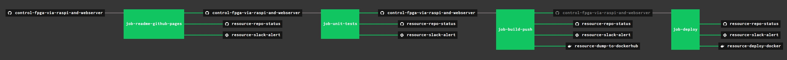

# control-fpga-via-raspi-and-webserver

_Control a FPGA via a Raspberry Pi and a Webserver. As an example, I burned my
[programable-8-bit-microprocessor](https://github.com/JeffDeCola/my-systemverilog-examples/tree/master/systems/microprocessors/programable-8-bit-microprocessor)
to an FPGA development board and you can control it at
[jeffdecola.com/fpga](http://jeffdecola.com/fpga)._

Table of Contents,

* [OVERVIEW](https://github.com/JeffDeCola/control-fpga-via-raspi-and-webserver#overview)
* [A LITTLE MORE DETAIL](https://github.com/JeffDeCola/control-fpga-via-raspi-and-webserver#a-little-more-detail)
* [SECTION I - THE FPGA](https://github.com/JeffDeCola/control-fpga-via-raspi-and-webserver#section-i---the-fpga)
* [SECTION II - THE RASPBERRY PI](https://github.com/JeffDeCola/control-fpga-via-raspi-and-webserver#section-ii---the-raspberry-pi)
  * [GPIO TO PMOD INTERFACE](https://github.com/JeffDeCola/control-fpga-via-raspi-and-webserver#gpio-to-pmod-interface)
  * [RASPBERRY PI TO WEBSERVER INTERFACE](https://github.com/JeffDeCola/control-fpga-via-raspi-and-webserver#raspberry-pi-to-webserver-interface)
* [SECTION III - THE WEBSERVER](https://github.com/JeffDeCola/control-fpga-via-raspi-and-webserver#section-iii---the-webserver)
* [MY GITHUB WEBPAGE IS UPDATED USING CONCOURSE (OPTIONAL)](https://github.com/JeffDeCola/control-fpga-via-raspi-and-webserver#my-github-webpage-is-updated-using-concourse-optional)

Documents and references,

* I burned my
  [programable-8-bit-microprocessor](https://github.com/JeffDeCola/my-systemverilog-examples/tree/master/systems/microprocessors/programable-8-bit-microprocessor)
  to a FPGA
* [raspi-gpio](https://github.com/JeffDeCola/my-go-examples/tree/master/single-board-computers/raspi-gpio)
is an example of controlling the GPIO (Input/Output) on the Raspberry Pi using go

[GitHub Webpage](https://jeffdecola.github.io/control-fpga-via-raspi-and-webserver/)

## OVERVIEW

This project is separated into 3 sections,

1. The FPGA
2. The Raspberry Pi (go code) to control the I/O of the FPGA
3. The Webserver to control the Raspberry Pi

This may help,

## A LITTLE MORE DETAIL

The following figure will be explained in the following three sections,

## SECTION I - THE FPGA

My
[programable-8-bit-microprocessor](https://github.com/JeffDeCola/my-systemverilog-examples/tree/master/systems/microprocessors/programable-8-bit-microprocessor)
will be used as an example. I designed the processor in Verilog
(An HDL language) and burned it to a FPGA development board. The entire process
can be found in that repo.

To operate the microprocessor,

* Set both inputs [7:0] DATA_IN_A and [7:0] DATA_IN_B
* Select an [3:0] OPCODE instruction (such as ADD)
* Enable the GO_BAR
* Oserve the resulting [7:0] DATA_OUT

The next section will show how to control the I/O via a Raspberry Pi.

## SECTION II - THE RASPBERRY PI

The Raspberry Pi shall control the I/O of the FPGA and provide an interface to
the webserver. The code has been written is go.

### GPIO TO PMOD INTERFACE

The GPIO (Input/Output) of the Raspberry Pi is connected to the
Input/Ouput of the FPGA development board via Pmod connectors.

There will be a total of 31 I/O pins.
The Raspberry Pi will connect to the processor as follows,

* **OUTPUT (CONTROL)**
  * [3:0] OPCODE
  * GO_BAR
  * RESET
  * JAM
  * [7:0] DATA_IN_A
  * [7:0] DATA_IN_B
* **INPUT (CAPTURE)**
  * [7:0] DATA_OUT

### RASPBERRY PI TO WEBSERVER INTERFACE

tbd

## SECTION III - THE WEBSERVER

tbd

## MY GITHUB WEBPAGE IS UPDATED USING CONCOURSE (OPTIONAL)

For fun, I use concourse to automatically update
[my GitHub Webpage](https://jeffdecola.github.io/control-fpga-via-raspi-and-webserver/) and alert me of
the changes via repo status and slack.

The update is accomplished this by copying and editing/updating
this `README.md` file to `/docs/_includes/README.md`.

A pipeline file [pipeline.yml](https://github.com/JeffDeCola/control-fpga-via-raspi-and-webserver/tree/master/ci/scripts/readme-github-pages.sh)
shows the entire ci flow. Visually, it looks like,

The `jobs` and `tasks` are,

* `job-readme-github-pages` runs task
  [readme-github-pages.sh](https://github.com/JeffDeCola/control-fpga-via-raspi-and-webserver/tree/master/ci/scripts/readme-github-pages.sh).

The concourse `resources types` are,

* `control-fpga-via-raspi-and-webserver` uses a resource type
  [docker-image](https://hub.docker.com/r/concourse/git-resource/)
  to PULL a repo from github.
* `resource-slack-alert` uses a resource type
  [docker image](https://hub.docker.com/r/cfcommunity/slack-notification-resource)
  that will notify slack on your progress.
* `resource-repo-status` uses a resource type
  [docker image](https://hub.docker.com/r/dpb587/github-status-resource)
  that will update your git status for that particular commit.

For more information on using concourse for continuous integration,
refer to my cheat sheet on [concourse](https://github.com/JeffDeCola/control-fpga-via-raspi-and-webserver/tree/master/software/operations-tools/continuous-integration-continuous-deployment/concourse-cheat-sheet).
